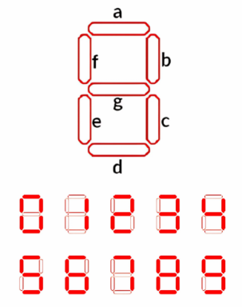
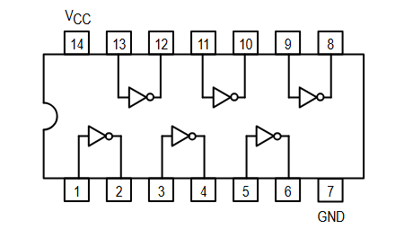
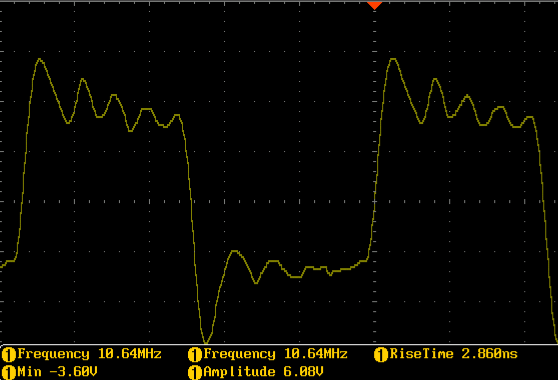
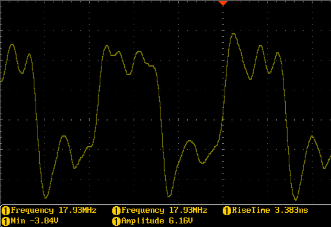
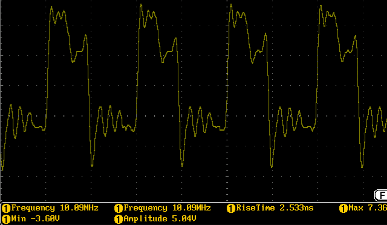
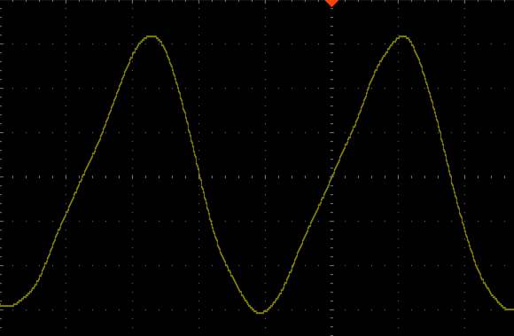

# Proyecto-1

## 1.Abreviaturas
-**FPGA**: Field Programable Gate Arrays

-**MSB**: Most Significant Bit

-**LSB**: Least Significant Bit

-**HDL**: Hardware Descrition Language

## 2. Desarrollo
### 2.0 Descripción general del sistema


El sistema implementado consiste en la generación y transmición de una palabra que posteriormente será procesada por el receptor. 
Para lograr este proceso se generara una palabra de 4 bits generada por un dip switch, se le realizara un proceso de códificación en donde se le añadirá los bits de pariedad en las posiciónes 0, 1 y 3. Esta palabra ya códificada se le podrá introducir un error en la posición deseada mediante un segundo dip switch (0 a 6).


## 2.1 Módulo 1
### Módulo encoder

```systemverilog
module module_encoder (
    input  logic [3:0] dip_switch, // Entrada de 4 bits dados por dip_switch
    output logic [2:0] parity_bits, // Bits de paridad calculados a partir de la entrada
    output logic [6:0] encoded_word // Salida de 7 bits que representa la palabra codificada
);
    logic x0, x1, x2, x3;
    assign{x0, x1, x2, x3} = dip_switch; // Asignación de los bits de entrada a variables individuales

    logic y1, y2, y4; //Bits de pariedad

    assign y1 = x0 ^ x1 ^ x3; // Cálculo del bit de paridad y1
    assign y2 = x0 ^ x2 ^ x3; // Cálculo del bit de paridad y2
    assign y3 = x1 ^ x2 ^ x3; // Cálculo del bit de paridad y3

assign encoded_word = {x3, x2, x1, y3, x0, y2, y1}; // Construcción de la palabra codificada con los bits de paridad y los bits de entrada
assign parity_bits = {y3, y2, y1}; // Asignación de los bits de paridad a la salida
endmodule

```
#### Funcionamiento
Este módulo tiene como entrada los 4 bits que da el dip switch, este mismo es controlado por el usuario.
Una vez ingresada la palabra se extraen el MSB y los bits 0, 1 y 2 para generar los bits de pariedad (y<sub>n</sub>) mediante dos XOR.
Para el primer bit de pariedad se usan los bits 0, 1 y MSB y se realiza la función XOR entre el bit 0 y el bit 1, y el resultado de este mismo se le realiza la segunda función XOR con el MSB.
Este proceso se repite con los otros dos bits de pariedad con la diferencia que para el segundo se reemplaza el bit 1 por el 2 y para el tercer bit de pariedad se reemplaza el LSB por el bit 1.
Al final este módulo devuelve la palabra códificada.


## 2.2 Módulo 2
### Módulo inyector de error

```systemverilog
module module_error_injection (
    input  logic [6:0] encoded_word, // Entrada de 7 bits que representa la palabra codificada
    input  logic [2:0] error_position, // Entrada de 3 bits que indica la posición del bit a invertir
    output logic [6:0] error_injected_word // Salida de 7 bits que representa la palabra codificada con el error inyectado
);

always @(*) begin
    error_injected_word = encoded_word; // Inicialización de la salida con la palabra codificada original

    // Inversión del bit en la posición indicada por error_position
    case (error_position)
        3'b000: error_injected_word = encoded_word;      // sin error
        3'b001: error_injected_word[0] = ~encoded_word[0]; // Invertir bit 0
        3'b010: error_injected_word[1] = ~encoded_word[1]; // Misma idea hasta el 7
        3'b011: error_injected_word[2] = ~encoded_word[2];
        3'b100: error_injected_word[3] = ~encoded_word[3];
        3'b101: error_injected_word[4] = ~encoded_word[4];
        3'b110: error_injected_word[5] = ~encoded_word[5];
        3'b111: error_injected_word[6] = ~encoded_word[6]; // Invertir bit 7
    endcase
    
end
endmodule

```
#### Funcionamiento

Este módulo es el encargado de "meter" el error, para esto recibe tanto la palabra códificada como la posición de error (determinada por el usuario en el segundo dip switch); mediante la sentencia always al momento de que ocurra un cambio en el dip switch se busca entre los posibles casos para realizar el cambio.
La sentencia case contiene todas las posibles combinaciones validas de este dip switch y dependiendo el caso en el que se encuentre se negará el bit en la posición deseada.
Cabe aclarar esté código fue creado para que cuando el dip switch este en 000 el mensaje se transmita sin error.


## 2.3 Módulo 3
### Módulo binario a hexadecimal
```systemverilog
module module_bin_to_hexa (
    input  logic [3:0] binary_input,// Entrada de 4 bits dados por deep_switch
    output logic [6:0] hex_output// Salida de 7 bits para el display de 7 segmentos
);

//Asignación de la salida del display de 7 segmentos según el valor de la entrada binaria
    assign hex_output = (binary_input == 4'b0000) ? 7'b0111111 : // 0
    (binary_input == 4'b0001) ? 7'b0000110 : // 1
    (binary_input == 4'b0010) ? 7'b1011011 : // 2
    (binary_input == 4'b0011) ? 7'b1001111 : // 3
    (binary_input == 4'b0100) ? 7'b1100110 : // 4
    (binary_input == 4'b0101) ? 7'b1101101 : // 5
    (binary_input == 4'b0110) ? 7'b1111101 : // 6
    (binary_input == 4'b0111) ? 7'b0000111 : // 7
    (binary_input == 4'b1000) ? 7'b1111111 : // 8
    (binary_input == 4'b1001) ? 7'b1101111 : // 9
    (binary_input == 4'b1010) ? 7'b1110111 : // A
    (binary_input == 4'b1011) ? 7'b1111100 : // b
    (binary_input == 4'b1100) ? 7'b0111001 : // C
    (binary_input == 4'b1101) ? 7'b1011110 : // d
    (binary_input == 4'b1110) ? 7'b1111001 : // E
    (binary_input == 4'b1111) ? 7'b1110001 : // F
                              7'b0000000;    

endmodule

```
#### Funcionamiento
Este módulo lo que nos permite es la visualización de la palabra que estemos queriendo transmitir en un 7 segmentos, para esto primero debemos de recibir la palbra de 4 bits, seguido mendiante la sentencia assign buscaremos el caso correspondiente a la entrada, cuando ya la halla encontrado lo siguiente que hace es mandar un 1 a las posiciones del 7 segmentos que se ocupan encender, por ejemplo para el 8 se ocupan encender los 7 segmentos por lo que se envían 7 1's, si fuera el 3 se encienden los segmentos a, b, c, d y g, por lo que se envía la secuencia de 1001111.

## 2.4 Módulo top
```systemverilog
module module_top (
    input  logic [3:0] switch,   
    input  logic [2:0] pos_error,     
    // Display 1: Mensaje de Entrada
    output logic [6:0] catodo_p0,        
    output logic anodo_p0,         // Pin 56

    // Display 2: Mensaje Transmitido (Hamming)
    output logic [6:0] salida,     

    // LEDs Integrados: Monitor de Entrada
    output logic [3:0] led 
);

    // Señales internas
    logic [6:0] codeword;
    logic [6:0] word_with_error;
    logic [6:0] final_word;

    // 1. Codificador Hamming (7,4)
    module_encoder encoder (
        .dip_switch(switch),
        .encoded_word(codeword),
        .parity_bits() // Ignoramos esta salida es nada para el testbench
    );

    // 2. Inyector de Error
    module_error_injection error_injector (
        .encoded_word(codeword),
        .error_position(pos_error),
        .error_injected_word(word_with_error)
    );

    assign final_word = word_with_error;

    // 4. Visualización en el Display  (Entrada Original)
    module_bin_to_hexa display_entrada (
        .binary_input(switch),
        .hex_output(catodo_p0)
    );

    // 5. Activación de Ánodos (Asumiendo Cátodo Común, enviar 1 para activar)
    assign anodo_p0 = 1'b1; 
    assign anodo_p1 = 1'b1;
    assign salida = final_word; // Invertimos para cátodo común

    // 6. LEDs de monitoreo en la FPGA
    assign led = ~switch;

endmodule
```
#### Funcionamiento
Este bloque final integra cada uno de los módulos anteriores dandoles la entrada de datos correspondientes y extrayendo los resultados necesarios (los bits de pariedad no son datos necesarios) que después seran empleados por la FPGA para transmitirlos a la parte receptora y al 7 segmentos.
La parte receptora recibira el mensaje emcriptado mientras que el 7 segmentos muestra el mensaje original.

## 4. Ejemplo de simplificación de las ecuaciones booleanas usadas para los 7 segmentos

Para la visualización de la palabra de entrada se utilizó el módulo `module_bin_to_hexa`, cuyo objetivo es convertir una entrada binaria de 4 bits en una salida de 7 bits correspondiente al valor hexadecimal mostrado en el display.

En el código, esta conversión se implementó mediante asignaciones directas para las 16 combinaciones posibles de entrada:

```systemverilog
 assign hex_output = (binary_input == 4'b0000) ? 7'b0111111 : // 0
    (binary_input == 4'b0001) ? 7'b0000110 : // 1
    (binary_input == 4'b0010) ? 7'b1011011 : // 2
    (binary_input == 4'b0011) ? 7'b1001111 : // 3
    (binary_input == 4'b0100) ? 7'b1100110 : // 4
    (binary_input == 4'b0101) ? 7'b1101101 : // 5
    (binary_input == 4'b0110) ? 7'b1111101 : // 6
    (binary_input == 4'b0111) ? 7'b0000111 : // 7
    (binary_input == 4'b1000) ? 7'b1111111 : // 8
    (binary_input == 4'b1001) ? 7'b1101111 : // 9
    (binary_input == 4'b1010) ? 7'b1110111 : // A
    (binary_input == 4'b1011) ? 7'b1111100 : // b
    (binary_input == 4'b1100) ? 7'b0111001 : // C
    (binary_input == 4'b1101) ? 7'b1011110 : // d
    (binary_input == 4'b1110) ? 7'b1111001 : // E
    (binary_input == 4'b1111) ? 7'b1110001 : // F
                              7'b0000000;    

```
Como ejemplo, se toma el segmento "a" del display. 
#### Ejemplo de Display del 7 segmentos



Sea la entrada de 4 bits:
```systemverilog

A B C D
```
donde A es el bit más significativo y D el menos significativo.

Para la codificación usada en el módulo, el segmento "a" se encuentra encendido para los símbolos:
```systemverilog

0, 2, 3, 5, 6, 7, 8, 9, A, b, C, d, E y F
```
y apagado para:
```systemverilog

1 y 4
```
Tomando esta tabla de verdad, la función del segmento a puede escribirse como:
```systemverilog

a(A,B,C,D) = Σm(0, 2, 3, 5, 6, 7, 8, 9, 10, 11, 12, 13, 14, 15)
```
Una forma simplificada de esta ecuación es:
```systemverilog

a = A + B + C + D'
```

Esto puede comprobarse fácilmente porque el segmento a solo se apaga cuando la entrada corresponde a 0001 o 0100, es decir, cuando hay exactamente ciertas combinaciones donde D = 1 o donde ninguno de los términos anteriores activa el segmento. Por lo tanto, la ecuación simplificada permite representar correctamente el comportamiento del segmento sin necesidad de evaluar los 16 casos por separado.

## 5. Ejemplo y análisis de una simulación funcional del sistema completo
Para validar el funcionamiento del transmisor completo se realizó una simulación funcional del módulo module_top, ya que este integra los principales bloques del sistema: module_encoder, module_error_injection y module_bin_to_hexa.

El flujo del sistema es el siguiente:

1. La palabra de entrada de 4 bits se recibe en switch.
2. Esa palabra se envía al módulo module_encoder, donde se genera la palabra codificada Hamming de 7 bits.
3. Luego, la palabra codificada pasa al módulo module_error_injection, que puede dejarla igual o invertir uno de sus bits según la posición seleccionada.
4. Finalmente, el sistema muestra la palabra original en el display de 7 segmentos y envía la palabra transmitida corregida o alterada por la salida salida.
### 4.1 Funcionamiento del codificador
En module_encoder, la palabra de entrada se separa de la siguiente forma:
```systemverilog

assign {x0, x1, x2, x3} = dip_switch;
```
Luego se calculan los bits de paridad:
```systemverilog

assign y1 = x0 ^ x1 ^ x3;
assign y2 = x0 ^ x2 ^ x3;
assign y3 = x1 ^ x2 ^ x3;
```
y finalmente se construye la palabra codificada:
```systemverilog

assign encoded_word = {x3, x2, x1, y3, x0, y2, y1};
```
De esta forma, el sistema toma los 4 bits originales y genera una palabra Hamming de 7 bits.

### 4.1 Funcionamiento del generador de error
El módulo module_error_injection recibe la palabra codificada y un valor de 3 bits llamado error_position.

Su lógica consiste en copiar primero la palabra original:
```systemverilog

error_injected_word = encoded_word;
```
y luego, dependiendo del valor de error_position, invertir únicamente el bit seleccionado.

Por ejemplo se tiene que:

```systemverilog
 // Inversión del bit en la posición indicada por error_position
    case (error_position)
        3'b000: error_injected_word = encoded_word;      // sin error
        3'b001: error_injected_word[0] = ~encoded_word[0]; // Invertir bit 0
        3'b010: error_injected_word[1] = ~encoded_word[1]; // Misma idea hasta el 7
        3'b011: error_injected_word[2] = ~encoded_word[2];
        3'b100: error_injected_word[3] = ~encoded_word[3];
        3'b101: error_injected_word[4] = ~encoded_word[4];
        3'b110: error_injected_word[5] = ~encoded_word[5];
        3'b111: error_injected_word[6] = ~encoded_word[6]; // Invertir bit 7
    endcase
```

Esto garantiza que si error_position = 000, la palabra se transmite sin error. Y si error_position toma otro valor, se altera únicamente un bit de la palabra codificada.

### 4.2 Ejemplo de simulación
Uno de los casos de prueba utilizados fue:
```systemverilog

switch     = 1011
pos_error  = 000
```
Con esta entrada, el sistema genera primero la palabra codificada Hamming correspondiente. Para 1011, el resultado obtenido fue:
encoded_word = 0110011
Como pos_error = 000, la salida del módulo de error permanece igual:
```systemverilog

salida = 0110011
```
Además, el display muestra la palabra de entrada 1011 en hexadecimal, es decir, la letra b.

Otro caso de prueba utilizado fue:
```systemverilog

switch     = 1011
pos_error  = 001
```
En este caso, la palabra codificada original era:
```systemverilog

0110011
```
y al aplicar error en la posición 001, se invierte el bit 0, obteniéndose:
```systemverilog

0110010
```
Esto permitió verificar que el módulo de inyección de error estaba funcionando correctamente y que solo alteraba la posición indicada.

### 4.3 Análisis de la simulación
La simulación funcional permitió confirmar varios aspectos importantes del sistema:

1. El módulo module_encoder genera correctamente la palabra Hamming de 7 bits a partir de la entrada de 4 bits.
2. El módulo module_error_injection deja intacta la palabra cuando pos_error = 000.
3. Para cualquier otra posición, únicamente se invierte un bit de la palabra codificada.
4. El módulo module_bin_to_hexa representa correctamente en el display la palabra de entrada en formato hexadecimal.
5. La salida salida contiene la palabra final transmitida, ya sea con o sin error.

Además, en module_top los LEDs se asignan como:
```systemverilog

assign led = ~switch;
```
Por lo que en la FPGA los LEDs funcionan como monitoreo invertido de la entrada. Esto fue útil durante las pruebas físicas, ya que permitió comprobar que la palabra leída por la FPGA coincidía con el estado de los interruptores de entrada.

### 4.5 Conclusión de la simulación
La simulación funcional del sistema completo permitió comprobar que el transmisor realiza correctamente la lectura de una palabra de 4 bits, su codificación mediante Hamming (7,4), la inserción opcional de un error y la salida final de la palabra transmitida. Asimismo, se verificó que el display muestra correctamente la palabra original en hexadecimal y que la lógica de inyección de error altera solamente el bit seleccionado.

En conjunto, esta simulación permitió validar tanto el funcionamiento individual de los módulos como su integración dentro del diseño final.

# 6. Consumo de recursos


El proceso de síntesis del diseño en la FPGA refleja una implementación altamente eficiente y de naturaleza puramente combinacional. De acuerdo con las estadísticas obtenidas, el sistema requiere un total de 27 tablas de búsqueda (LUTs) y 9 multiplexores de jerarquía superior (MUX2) para ejecutar la lógica del codificador Hamming y la decodificación de los displays, lo cual representa un uso mínimo de los recursos lógicos del dispositivo. Cabe destacar la ausencia de Flip-Flops (FFs) y bloques de memoria, lo que confirma que el flujo de datos no depende de un reloj secuencial, minimizando así la latencia de procesamiento.

# 7. Problemas encontrados durante el proyecto
### Curva de aprendizaje: 
La principal dificultad se encontró en la curva de aprendizaje que conlleva aprender a programar en un nuevo lenguaje y que, además, es HDL, en anteriores cursos solo se habia realizado trabajo con software software. La solución para esto fue buscar recursos en interne como lo son vídeos y foros, aunado a esto se empleo el libro de texto, así como la gran ayuda del asistente del curso que sacó tiempo personal para aclarar dudas y ayudarnos a resolver problemas de la implemenación.

### Modulo de inyección del error.
Como tal el módulo de inserción de error no es muy complicado, sin embargo, a la hora de realizarlo nos invertía todos los bits del mensaje encríptado (lo cuál no se quería); para solucionarlo investigamos en internet y el compañero Jose encontró que ocupabamos poner un parentesis cuadrado a la par de error_injected_word[n], siendo n el lugar donde se quiere el error.

### No se presentaba la inyección del error a partir de 100:
Este error fue el que más nos molestó durante la realización del proyecto; durante una semana estuvimos intentando corregirlo sin éxito, sin embargo a menos de dos minutos de la entrega hicimos un cambio en los constraints, específicamente en el pin donde entraba el error, lo movimos del pin 35 al 41 y se arregló el error.
Desconocemos la razón de porqué este pin causaba el error.


# 8. Oscilador en anillos 
## 8.1.1 Descripción
A su vez, se trabajó en la implementación de un oscilador en anillos usando una compuerta NOT 74LS04. Esto con el objetivo de relacionar el periodo de oscilación medido con el retardo de propagación promedio de los inversores. Las indicaciones eran que se debe armar el oscilador con el mínimo de alambrado posible, medir la frecuencia con el osciloscopio, estimar el tiempo de propagación promedio, repetir el experimento con tres inversores, insertar aproximadamente un metro de alambre y finalmente analizar el caso de un solo inversor realimentado.

## 8.1.2 Diagrama de la compuerta 74LS04


## 8.1.3 Oscilador con 5 inversores
Tal y como indica el título, se conectaron las 5 compuertas NOT retroaliméntandose entre sí para formar el anillo, tomando en consideración los pines de alimentación y salida a tierra. 

## 8.1.4 Salida del Osciloscopio


## 8.1.5 Cálculo para los 5 NOT

La frecuencia medida fue de:

`f = 10.64 MHz`

`T = 1/f = 1 / 10.64 MHz ≈ 93.98 ns`

Para un oscilador en anillo:

`T = 2N t_p`

`t_p = T / (2N)`

Como se utilizan 5 NOT's:

`N = 5`

Se obtiene:

`t_p = 93.98 ns / (2·5)`

`t_p = 93.98 ns / 10`

`t_p ≈ 9.40 ns`

# 8.1.6 Conclusión
A partir de la frecuencia medida de 10.64 MHz, se obtuvo un período de aproximadamente 93.98 ns. Usando la relación del oscilador en anillo con 5 inversores, se estimó un retardo de propagación promedio de 9.40 ns por compuerta NOT. Este resultado confirma que la oscilación del circuito está directamente asociada a la suma de los retardos de propagación de los inversores que conforman el anillo.

## 8.2 Oscilador con 3 inversores
De la misma manera se conectaron las 3 compuertas NOT retroalimentándose entre sí para formar el anillo.

## 8.2.1 Salida del Osciloscopio


## 8.2.2 Cálculo para los 3 NOT

La frecuencia medida fue de:

`f = 17.93 MHz`

`T = 1/f = 1 / 17.93 MHz ≈ 55.77 ns`

Para un oscilador en anillo:

`T = 2N t_p`

`t_p = T / (2N)`

Como se utilizan 3 NOT's:

`N = 3`

Se obtiene:

`t_p = 55.77 ns / (2·3)`

`t_p = 55.77 ns / 6`

`t_p ≈ 9.30 ns`

# 8.2.3 Conclusión
A partir de la frecuencia medida de 17.93 MHz, se obtuvo un período de aproximadamente 55.77 ns. Usando la relación del oscilador en anillo con 3 inversores, se estimó un retardo de propagación promedio de 9.30 ns por compuerta NOT. Este resultado es consistente con el obtenido para el oscilador de 5 inversores, lo cual confirma que el retardo de propagación promedio de cada inversor se mantiene aproximadamente constante y que el cambio en el período total depende principalmente de la cantidad de etapas presentes en el anillo.

## 8.3 Oscilador con 3 inversores y cable de aproximadamente 3 metros
Para esta prueba, se utilizó el oscilador en anillo con 3 compuertas NOT y se añadió un cable de aproximadamente 3 metros. Esto permitió observar cómo la longitud adicional del conductor afecta el comportamiento de la señal debido al aumento de efectos de la capacitancia e inductancia.

## 8.3.1 Salida del Osciloscopio


## 8.3.2 Cálculo para los 3 NOT con cable de 3 metros

La frecuencia medida fue de:

`f = 10.09 MHz`

`T = 1/f = 1 / 10.09 MHz ≈ 99.11 ns`

Para un oscilador en anillo:

`T = 2N t_p`

`t_p = T / (2N)`

Como se utilizan 3 NOT's:

`N = 3`

Se obtiene:

`t_p = 99.11 ns / (2·3)`

`t_p = 99.11 ns / 6`

`t_p ≈ 16.52 ns`

# 8.3.3 Conclusión
A partir de la frecuencia medida de 10.09 MHz, se obtuvo un período de aproximadamente 99.11 ns. Usando la relación del oscilador en anillo con 3 inversores, se estimó un retardo de propagación promedio de 16.52 ns por compuerta NOT. Este valor es mayor al obtenido sin el cable adicional, lo cual indica que la longitud extra del conductor introdujo efectos parásitos que aumentaron el retardo total del circuito y redujeron la frecuencia de oscilación.

## 8.4 Análisis para 1 inversor
En esta prueba se tomó una sola compuerta NOT del 74LS04 y se conectó su salida directamente a su entrada. A diferencia del oscilador en anillo con 3 o 5 inversores, esta configuración no establece una oscilación periódica bien definida, por lo que no se obtiene una frecuencia estable para realizar cálculos como en los casos anteriores.

El comportamiento observado se debe a que el inversor intenta realimentarse a sí mismo. Como la salida depende de la entrada y, al mismo tiempo, la entrada depende de la salida en un bucle, el circuito tiende a ubicarse cerca del punto de transición entre los niveles lógicos bajo y alto. En esa región, pequeñas perturbaciones de ruido o variaciones internas pueden producir una señal de baja amplitud o comportamiento inestable.


## 8.4.1 Señal observada en el osciloscopio


## 8.4.2 Interpretación del resultado
A diferencia de un oscilador en anillo con un número impar de etapas, un único inversor realimentado no produce una oscilación útil y estable para caracterización temporal. En cambio, la señal queda dominada por el punto de operación del inversor, el ruido presente en el circuito y las pequeñas capacitancias parásitas del montaje.

# 8.4.3 Conclusión
Con un solo inversor realimentado no se forma un oscilador funcional como tal, por lo que no es posible asociar una frecuencia de oscilación definida ni calcular un retardo de propagación de la misma forma que en los montajes con 3 o 5 inversores. El resultado principal de esta prueba es evidenciar que el inversor puede quedar polarizado cerca de su umbral de conmutación, mostrando una señal sensible al ruido y a los efectos parásitos del circuito.
